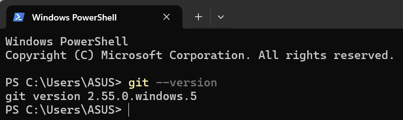
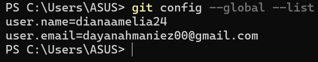
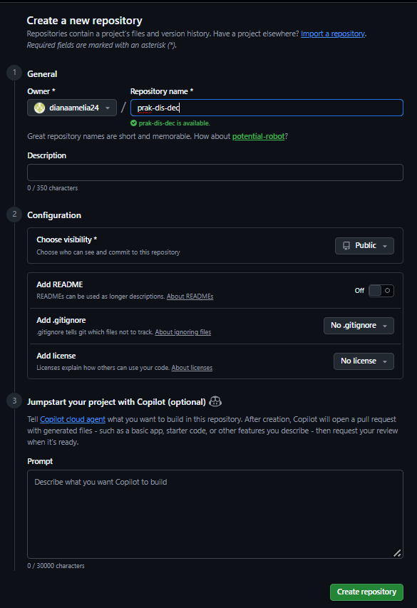
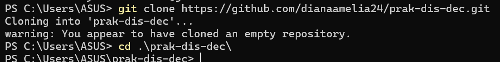
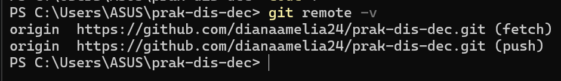

# Laporan Praktikum Sistem Terdistribusi dan Terdesentralisasi

## Pertemuan 01: Pengenalan Git dan GitHub

### Identitas

- Nama: **Diana Amelia**
- NIM: **255410042**
- Kelas: **Informatika-1**

## 1. Tujuan

1. Memahami fungsi Git sebagai sistem pengelolaan versi.
2. Memahami fungsi GitHub sebagai layanan penyimpanan repository secara daring.
3. Mengonfigurasi Git pada komputer lokal.
4. Membuat dan mengelola repository Git.
5. Mempraktikkan proses clone, branch, commit, push, dan pull request.
6. Mendokumentasikan hasil praktikum menggunakan repository GitHub.

## 2. Dasar Teori

### 2.1 Git

Git adalah sistem version control terdistribusi yang digunakan untuk mencatat perubahan file. Git memungkinkan pengguna membuat commit, melihat riwayat perubahan, membuat branch, serta mengembalikan file ke kondisi sebelumnya.

### 2.2 GitHub

GitHub adalah layanan berbasis web yang digunakan untuk menyimpan repository Git secara remote. GitHub juga menyediakan fitur kolaborasi seperti pull request, code review, dan pengelolaan branch.

### 2.3 Istilah Penting

- **Repository**: tempat penyimpanan file dan riwayat perubahan.
- **Remote repository**: repository yang berada di server, dalam praktikum ini berada di GitHub.
- **Commit**: catatan permanen atas perubahan yang dilakukan.
- **Branch**: cabang pengembangan yang terpisah dari branch utama.
- **Push**: mengirim commit dari repository lokal ke remote repository.
- **Pull**: mengambil perubahan dari remote repository ke repository lokal.
- **Pull request**: permintaan untuk menggabungkan perubahan dari suatu branch ke branch lain.
- **Merge**: proses penggabungan perubahan dari dua branch.

## 3. Alat dan Bahan

- Komputer atau laptop.
- Git.
- Akun GitHub.
- Terminal atau command prompt.
- Text editor.
- Repository GitHub: [prak-dis-dec](https://github.com/dianaamelia24/prak-dis-dec).

## 4. Langkah Pengerjaan

### 4.1 Memeriksa Instalasi Git

Langkah pertama adalah memeriksa ketersediaan Git pada komputer. Pemeriksaan
dilakukan melalui Windows PowerShell dengan perintah `git --version`. Perintah
ini tidak mengubah file atau konfigurasi apa pun; fungsinya hanya menampilkan
versi Git yang sedang terpasang. Berdasarkan screenshot, perintah menghasilkan
`git version 2.55.0.windows.5`. Dengan demikian, Git telah terpasang dan siap
digunakan untuk mengelola repository praktikum.



### 4.2 Mengonfigurasi Identitas Pengguna Git

Identitas pengguna diperlukan agar setiap commit memiliki informasi pembuat yang
jelas. Konfigurasi dilakukan secara global sehingga dapat digunakan oleh seluruh
repository pada komputer tersebut. Perintah yang digunakan adalah:

```bash
git config --global user.name "dianaamelia24"
git config --global user.email "dayanahmaniez00@gmail.com"
git config --global --list
```

Dua perintah pertama menyimpan nama dan alamat email, sedangkan perintah terakhir
menampilkan konfigurasi global yang telah tersimpan. Screenshot memperlihatkan
bahwa `user.name` bernilai `dianaamelia24` dan `user.email` bernilai
`dayanahmaniez00@gmail.com`. Konfigurasi ini akan digunakan secara otomatis ketika
commit dibuat.



### 4.3 Membuat Repository di GitHub

Repository dibuat melalui halaman **Create a new repository** di GitHub. Pada
formulir tersebut, pemilik repository adalah akun `dianaamelia24`, sedangkan
nama repository diisi `prak-dis-dec`. Visibilitas dipilih **Public** agar
repository dapat diakses untuk keperluan pengumpulan atau pemeriksaan praktikum.
Opsi pembuatan README, `.gitignore`, dan license tidak diaktifkan karena file
praktikum akan ditambahkan dari repository lokal.

Setelah pengaturan diperiksa, tombol **Create repository** dipilih. Repository
remote ini menjadi tempat penyimpanan terpusat untuk laporan pertemuan pertama
dan materi praktikum berikutnya.



### 4.4 Melakukan Clone Repository

Repository GitHub yang baru dibuat kemudian disalin ke komputer lokal menggunakan
perintah:

```bash
git clone https://github.com/dianaamelia24/prak-dis-dec.git
cd .\prak-dis-dec\
```

Screenshot memperlihatkan proses cloning selesai dengan pesan peringatan bahwa
repository masih kosong. Peringatan tersebut muncul karena belum ada commit pada
repository remote, bukan karena proses clone gagal. Setelah itu, perintah `cd`
digunakan untuk masuk ke folder `prak-dis-dec` sehingga perintah Git berikutnya
dijalankan pada repository yang benar.



### 4.5 Memeriksa Remote Repository

Setelah masuk ke folder repository, koneksi ke repository GitHub diperiksa dengan:

```bash
git remote -v
```

Hasil pemeriksaan menunjukkan remote bernama `origin` yang memiliki dua alamat
operasi yang sama, yaitu:
`https://github.com/dianaamelia24/prak-dis-dec.git`. Label `(fetch)` menunjukkan
alamat untuk mengambil data dari GitHub, sedangkan label `(push)` menunjukkan
alamat untuk mengirim commit ke GitHub. Pemeriksaan ini memastikan repository
lokal telah terhubung ke remote yang benar sebelum proses sinkronisasi dilakukan.



### 4.6 Memeriksa Branch dan Status Repository

Sebelum menambahkan file, branch dan status repository diperiksa:

```bash
git branch
git status
```

Screenshot menunjukkan repository berada pada branch `main` dan belum memiliki
commit. Folder `01/` tercantum sebagai **Untracked files**, yang berarti folder
tersebut sudah ada di direktori kerja, tetapi belum dimasukkan ke area staging
dan belum dicatat oleh Git. Status ini menjadi dasar sebelum file ditambahkan
dengan `git add`.


### 4.7 Menambahkan File, Membuat Commit, dan Push ke GitHub

Seluruh file praktikum ditambahkan ke staging area, lalu disimpan sebagai commit
pertama:

```bash
git add .
git commit -m "docs: add file README.md"
git log --oneline
git push origin main
```

Perintah `git add .` memindahkan perubahan pada direktori saat ini ke staging
area. Perintah `git commit` kemudian membuat snapshot permanen dengan pesan
`docs: add file README.md`. Perintah `git log --oneline` menampilkan commit
secara ringkas dan memperlihatkan hash `673fa21` sebagai identitas commit
pertama. Terakhir, `git push origin main` mengirim commit dari branch lokal
`main` ke branch `main` pada GitHub.

Output menunjukkan objek berhasil dihitung, ditulis, dan dikirim ke URL GitHub.
Baris `main -> main` menandakan tujuan push adalah branch `main` di remote.


### 4.8 Membuat Branch Praktikum

Agar perubahan lanjutan tidak langsung dilakukan pada branch utama, branch baru
bernama `images` dibuat menggunakan:

```bash
git switch -c images
git status
git diff
```

Perintah `git switch -c images` membuat branch baru sekaligus memindahkan posisi
kerja ke branch tersebut. Screenshot memperlihatkan pesan `Switched to a new
branch 'images'`. Pemeriksaan berikutnya menunjukkan branch aktif adalah
`images`, sedangkan file `01/README.md` berstatus **modified** dan belum
dimasukkan ke staging area. Perintah `git diff` digunakan untuk melihat isi
perubahan sebelum perubahan tersebut diputuskan untuk di-stage dan di-commit.


### 4.9 Menyiapkan Pull Request

Setelah perubahan pada branch `images` selesai diperiksa, alur lanjutan yang
seharusnya dilakukan adalah:

```bash
git add .
git commit -m "docs: update praktikum pertemuan 01"
git push -u origin images
```

Setelah branch berhasil dikirim ke GitHub, halaman pembuatan pull request dibuka
melalui menu **Pull requests**. Pada screenshot, bagian
`base` menunjukkan `main`, sedangkan bagian `compare` menunjukkan `imagas`.
GitHub juga menampilkan status **Able to merge**, yang berarti perubahan dari
branch pembanding dapat digabungkan secara otomatis pada saat itu. Judul pull
request yang digunakan adalah `docs: add folder image serta foto pengerjaan`.

Screenshot tambahan ini merupakan bukti hasil pengerjaan tahap persiapan
pull request. Formulir sudah memuat branch sumber, branch tujuan, dan judul
perubahan. Namun, tombol **Create pull request** masih terlihat, sehingga
screenshot belum membuktikan bahwa pull request sudah berhasil dibuat. Untuk
menyelesaikan tahap ini, deskripsi perubahan dapat diisi jika diperlukan,
kemudian tombol **Create pull request** dipilih. Setelah PR terbentuk, perubahan
dapat ditinjau dan di-merge sesuai kebutuhan.


## 5. Hasil Praktikum

Hasil praktikum dapat dibedakan menjadi hasil yang sudah terlihat pada screenshot
dan aktivitas yang masih menjadi prosedur lanjutan. Ringkasan hasil yang
terverifikasi adalah:

| No. | Tahap | Hasil yang Terlihat |
| --- | --- | --- |
| 1 | Pemeriksaan Git | Git versi `2.55.0.windows.5` tersedia di komputer. |
| 2 | Konfigurasi pengguna | `user.name` dan `user.email` tersimpan pada konfigurasi global. |
| 3 | Pembuatan repository | Repository publik `prak-dis-dec` dibuat pada akun `dianaamelia24`. |
| 4 | Clone | Repository berhasil disalin ke komputer lokal; kondisi awalnya masih kosong. |
| 5 | Remote | Remote `origin` mengarah ke repository GitHub yang sesuai. |
| 6 | Status awal | Branch `main` terdeteksi dan folder `01/` berstatus untracked. |
| 7 | Commit | Commit pertama berhasil dibuat dengan hash singkat `673fa21`. |
| 8 | Push | Commit berhasil dikirim ke `origin/main`, ditunjukkan oleh output `main -> main`. |
| 9 | Branch | Branch `images` berhasil dibuat dan menjadi branch aktif. |
| 10 | Pemeriksaan perubahan | `01/README.md` terdeteksi modified dan siap ditinjau melalui `git diff`. |
| 11 | Persiapan pull request | Formulir PR menampilkan perbandingan `imagas` ke `main`, judul perubahan, dan status **Able to merge**. |

Seluruh bukti visual disimpan pada direktori `01/images/`. Screenshot pull
request membuktikan halaman pengajuan telah disiapkan, tetapi belum membuktikan
pengajuan atau merge selesai karena tombol **Create pull request** masih terlihat.

## 6. Analisis

Praktikum memperlihatkan hubungan antara tiga lokasi utama dalam Git, yaitu
working directory, staging area, dan repository. Folder `01/` pertama kali
berada pada working directory dan terdeteksi sebagai untracked. Setelah
menjalankan `git add .`, file dipersiapkan pada staging area. Perintah
`git commit` kemudian menyimpan snapshot perubahan ke repository lokal. Dengan
`git push origin main`, snapshot tersebut dikirim ke repository remote di GitHub.

Urutan tersebut menunjukkan bahwa perubahan file tidak otomatis tersimpan di
GitHub. Setiap perubahan perlu melalui pemeriksaan status, staging, commit, dan
push. Pesan commit `docs: add file README.md` juga menunjukkan praktik penamaan
commit yang menjelaskan jenis perubahan dan isi utamanya.

Pembuatan branch `images` menunjukkan penggunaan branching untuk memisahkan
pekerjaan lanjutan dari branch `main`. Pada screenshot, file README berstatus
modified tetapi belum staged. Hal ini penting karena Git memberikan kesempatan
untuk meninjau perbedaan melalui `git diff` sebelum perubahan dicatat. Dalam
alur kolaborasi, branch tersebut kemudian dapat dikirim ke GitHub dan diajukan
melalui pull request agar perubahan dapat ditinjau sebelum merge.

Dari sisi pengelolaan repository, `main` berfungsi sebagai branch utama yang
menampung versi stabil, sedangkan branch pembanding `imagas` pada screenshot
digunakan untuk mengajukan perubahan ke `main`. Pemisahan ini menyediakan ruang
kerja untuk perubahan berikutnya dan mengurangi risiko perubahan yang belum
ditinjau langsung masuk ke branch utama.

Perlu diperhatikan bahwa screenshot pembuatan branch menampilkan nama `images`,
sedangkan screenshot pull request menampilkan branch pembanding `imagas`.
Keduanya dicatat sesuai nama yang terlihat pada masing-masing bukti, sehingga
nama branch sebaiknya dipastikan kembali sebelum laporan final dikumpulkan.

## 7. Kendala dan Solusi

| Kendala yang Ditemukan | Solusi atau Pemahaman yang Diperoleh |
| --- | --- |
| Repository GitHub masih kosong setelah dibuat. | Repository tetap di-clone terlebih dahulu. Peringatan empty repository dipahami sebagai informasi bahwa belum ada commit, bukan kegagalan clone. |
| File `01/` muncul sebagai untracked. | Menjalankan `git add .` untuk memasukkan file ke staging area sebelum commit. |
| Perubahan belum muncul di GitHub setelah diedit. | Menjalankan urutan `git status`, `git add`, `git commit`, dan `git push`. |
| Belum jelas remote mana yang digunakan. | Memeriksa `git remote -v` dan memastikan `origin` mengarah ke URL repository yang benar. |
| Perlu mengembangkan perubahan tanpa mengganggu `main`. | Membuat branch `images` menggunakan `git switch -c images`. |
| Perubahan pada README perlu diperiksa sebelum dicatat. | Menggunakan `git diff` untuk meninjau perbedaan working directory dengan commit terakhir. |
| Pull request masih berada pada halaman pengisian. | Memeriksa branch dasar `main`, branch pembanding `imagas`, judul perubahan, dan status **Able to merge** sebelum memilih **Create pull request**. |

## 8. Kesimpulan

Praktikum pertemuan pertama berhasil memperkenalkan alur dasar pengelolaan
proyek menggunakan Git dan GitHub. Git digunakan pada komputer lokal untuk
memeriksa status, menyiapkan file, membuat commit, melihat riwayat, dan membuat
branch. GitHub digunakan sebagai remote repository untuk menyimpan serta
membagikan commit melalui proses push.

Berdasarkan screenshot, Git telah terpasang, identitas pengguna telah
dikonfigurasi, repository `prak-dis-dec` telah dibuat dan dihubungkan, commit
pertama telah dikirim ke `main`, serta branch `images` telah berhasil dibuat.
Praktikum ini juga menunjukkan pentingnya memeriksa perubahan menggunakan
`git status` dan `git diff` sebelum membuat commit. Selain itu, halaman pull
request telah disiapkan untuk membandingkan branch `imagas` dengan `main` dan
menunjukkan bahwa perubahan dapat di-merge. Namun, pembuatan pull request dan
merge final belum dapat dinyatakan selesai karena bukti masih menampilkan
formulir sebelum tombol **Create pull request** dipilih.

## 9. Referensi

1. [Petunjuk Penggunaan Git dan GitHub](https://github.com/NEO-X-School/notes/tree/main/petunjuk-git-github)
2. [Git Documentation](https://git-scm.com/doc)
3. [GitHub Documentation](https://docs.github.com/)
